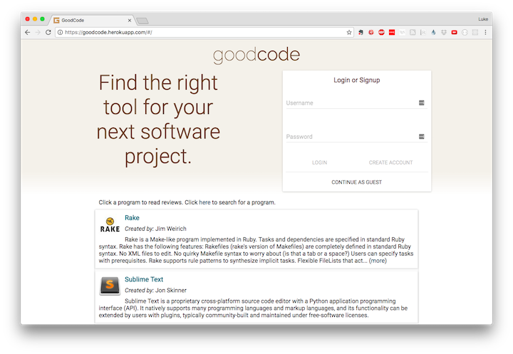

# Goodcode

[goodcode][heroku-link] is a web application that allows users to review coding tools.
It is inspired by goodreads.
Users can add entries for new tools, then review them, mark them with various statuses, and search for them.

Goodcode was created in less than two weeks as a final project at App Academy.
It is a personal project of Luke Wassink.

## Features

* Secure user authentication.
* Creation, deletion and editing of coding tools and reviews.
* Image upload and storage in a CDN.
* Reviews can be written in markdown with a live preview.
* Responsive, controlled forms that show frontend errors in real time.
* Setting a status ("Have used", "Want to use", etc) for coding tools and the ability to view tools by status.
* Search tools by name and creator.
* Infinite scroll for the programs index.

## Product Design

Goodcode was built in two weeks.
This included creating a [development plan][development-readme] which has a timeline and links to a database schema, wireframe drawings of the components and other design documents.

## Technology

Goodcode is a full stack application built using Ruby on Rails and React.js.

* [Frontend][frontend]
* [Backend][backend]
* [Cloudinary for images][cloudinary]

## Testing

There are tests for the Rails models and controllers written in RSpec using
* rspec-rails
* faker
* shoulda-matchers
* rails-controller-testing

## Future Implementations

While goodcode does have some additional features beyond the initial MVP plan, there are still many possible features that could be added.
See the [future implementation outline][future-implementation-outline] for details.

[heroku-link]: https://goodcode.herokuapp.com
[development-readme]: ./docs/README.md
[frontend]: ./docs/frontend.md
[backend]: ./docs/backend.md
[cloudinary]: ./docs/cloudinary.md
[future-implementation-outline]: ./docs/future_implementations.md
